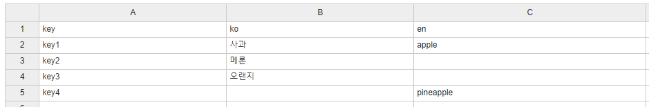

정리되지 않은 메시지 프로퍼티 정리용 유틸
======
번역파일 정리하기 귀찮아서 끄적임

- ----
- messages_ko.properties
<pre>
key1 = 사과
key2 = 메론
key3 = 오랜지
</pre>
- messages_en.properties

<pre>
key1 = apple
key2 =
key4 = pineapple
</pre>
----
> 실행결과
<pre>
# csv 파일 형식
"key","ko","en"
"key1","사과","apple"
"key2","메론",""
"key3","오랜지",""
"key4","","pineapple"
</pre>

